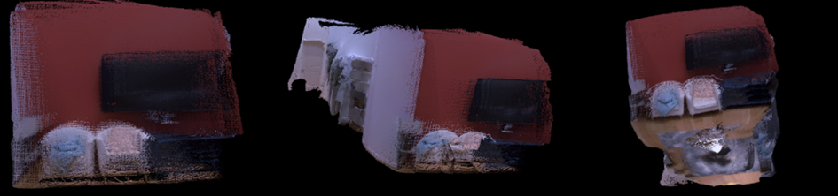
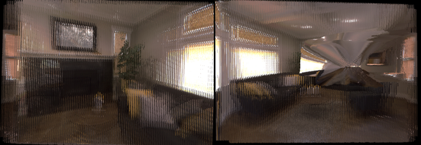

# 纯单目视觉实时三维稠密重建实现

> 本科毕业设计主要工作，只使用单个RGB相机完成实时稠密重建

项目基于Socket实现数据通信，可选用cva_mvsnet或zoedepth作为单目深度估计模块，运行前参考文件位置预留，运行python端待模型加载完毕后，再打开Orbslam2单目模式即可，点云使用pcl库绘制。

经测试，最大显存占用不超过3.2GB，对性能要求较小，但因此效果不佳，故仅作为学习项目使用。

大致效果如图：

